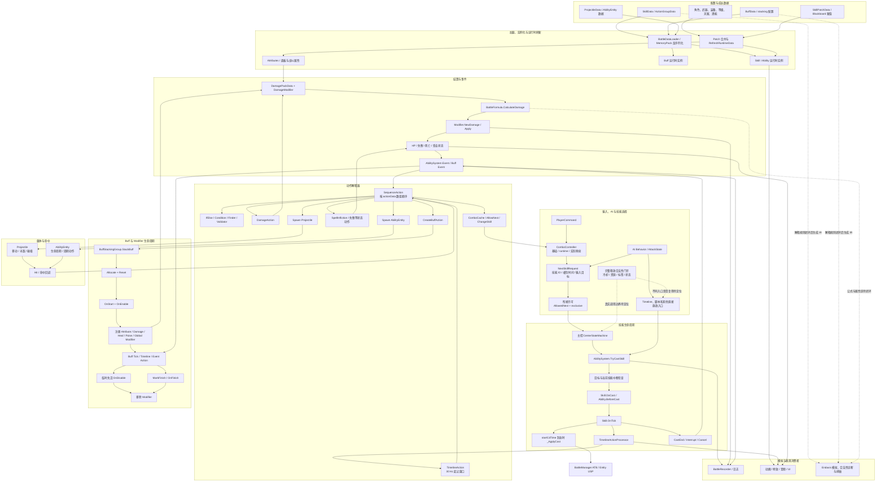

# 战斗系统总图

## 三层对象

终末地战斗逻辑至少需要区分三层，不能把同名字段直接视作最终行为。

```text
配置层
  SkillData / BuffData / ProjectileComponentData / Character 与成长表
  SkillPatchData / 天赋与潜能效果表 / 黑板
        |
        | 反序列化、Patch、运行时刷新
        v
运行时状态层
  BattleManager / AbilitySystem / Skill / ComboController
  Buff 实例 / 属性与 Modifier / 资源计时器 / 连携等待队列
        |
        | Tick、事件、条件、动作执行
        v
结算与表现层
  TimelineAction / SequenceAction / DamageAction / CreateBuffAction
  Projectile / AbilityEntity / Hit / BattleFormula / 表现动画与特效
```

配置层说明“有哪些数据”；运行时状态层决定“当前能否发生”；结算层决定“这一帧按什么顺序
发生”。自动生成必须理解三层之间的解释规则，而不是只读取配置层。

## 当前运行时架构总图

下图描述当前已经恢复的系统边界。实线节点和连线已有静态运行时证据；虚线表示对象和入口
存在，但关键调用条件、排序或公式尚未闭环。



这张图中的最大缺口不是缺少对象，而是几条边的语义尚未完全恢复：

- `Skill.IsAvailable` 或等价完整门禁究竟由哪些施放入口调用；
- stacking 类型如何选择刷新、增强、覆盖、共存和优先级失活分支；
- `DamagePackData` 到 `BattleFormula` 之间所有属性区与 Modifier 的精确顺序；
- 事件监听者排序、递归触发及跨实体传播；
- 投射物碰撞、AbilityEntity 周期和 Hit 去重的完整规则；
- 等级、天赋、潜能和形态 Patch 的最终合并顺序。

## 技能生命周期主干

主控玩家技能的当前已确认流程如下：

```text
PlayerCommand
  -> ComboController 解析实际命令映射
  -> 创建 NextSkillRequest 并缓存输入
  -> Tick 检查 AllowedNext / exclusive 衔接许可
  -> CenterStateMachine 准备技能状态迁移和输入目标
  -> CenterSkillState 调用 AbilitySystem.TryCastSkill
  -> 检查当前技能中断和目标
  -> Skill.DoCast / Ability.BeforeCast
  -> Skill.OnTick
       -> 到 startCdTime 时 _ApplyCost
       -> exclusive 回调
       -> TimelineAction / SequenceAction
       -> Buff、Hit、投射物、AbilityEntity 与事件
  -> CastEnd / Interrupt / Cancel
       -> Timeline End
       -> 冷却、Buff 和技能结束事件
```

`Skill.IsAvailable` 自身确实按冷却、成本、标签和实体状态顺序检查，但当前尚未发现它在上述
主控链、`CanCastSkill` 或 `TryCastSkill` 中的直接调用。因此它被画成独立的待定位门禁，不能
为了图形连贯而虚构成 `TryCastSkill` 的固定内部步骤。

同样，实际扣费不在 `DoCast` 中，而由 `Skill.OnTick` 在 `startCdTime` 边界调用 `_ApplyCost`。
这也是“释放成立”和“实际扣费时点”必须分开建模的原因。

## 时间模型

- 战斗技能时间轴以固定 `1/30s` 逻辑帧解释。
- `TimelineActionProcessor` 使用 `floor(passedTime / frameInterval)` 得到当前逻辑帧。
- 动作起点使用浮点容差比较；同一个 `SequenceAction` 内的动作按数组顺序同步调用。
- “同一逻辑帧”不等于“同时”：前一个调用造成的状态变化可被后一个调用读取。
- `exclusiveFrame`、`AllowNextSkillAction`、动画长度和 `durationFrame` 是不同概念，
  不能任选一个当作 Endaxis segment 时长。

## 状态与数值读取

伤害行为不只依赖 `DamageAction` 中的倍率。至少还会读取：

- 攻击者和目标的运行时属性；
- 技能等级 Patch 与黑板；
- 当前 Buff、伤害 Modifier 和标签；
- 伤害类型、元素、防御、抗性、暴击和特殊修正；
- Hit 前面已经执行的动作与事件监听者产生的状态变化。

已确认 `_TakeDamageCalculationSnapshot` 会按 `DamageUnit.takeAtkSnapshot` 决定是否在
动作重置时缓存基础 `CalcResult.value`；关闭时则在命中阶段使用经过 BeforeCalculation
modifier 刷新的攻击者/目标属性副本。该快照不包含后续最终伤害倍率、防御、抗性和暴击，
因此“技能出手时冻结完整最终伤害”仍不能作为默认假设。必须逐 DamageUnit 读取配置，并
区分基础计算快照与命中时公式结算。

## 技能身份与替换

一个按键最终释放的技能可能经历多次映射：

```text
输入槽位
  -> 基础技能 ID
  -> 当前形态/状态对应的运行时映射
  -> 派生或强化技能
  -> 实际 Skill 实例
```

因此“普通技能与强化技能互斥”“终结技期间替换普攻”等规则，不应只从 UI 名称推导。
需要确认 `ComboController` 的基础映射、运行时映射、实际映射和替换事件分别在何时刷新，
以及存量技能实例是否重建或只调用 `RefreshRuntimeData`。

## Buff 与事件

Buff 不是单一的属性加减对象。需要分别恢复：

- 创建条件、目标选择和来源归属；
- 初次应用、刷新、延长、覆盖、叠层与移除；
- 属性 Modifier；
- 对技能开始、Hit、伤害前后、状态变化和 Tick 的监听；
- 由 Buff 触发的新动作、Buff、伤害或技能替换；
- 同一次事件中监听者的排序和递归触发保护。

目前仅确认显式 `SequenceAction` 内没有“Buff 永远先于伤害”这样的类型优先级。Buff 是否
影响当前次伤害，取决于它在动作数组中的位置、是否即时生效，以及伤害公式读取属性的时机。

## 投射物与 AbilityEntity

这两类对象不能直接降低成一个固定 `hit.offset`：

- 投射物有发射时点、初始位置、速度曲线、寻敌、碰撞检测延迟和命中回调；
- AbilityEntity 可能持续存在、重复选取目标、按周期触发 SkillData 或 Buff；
- 玩家与敌人的位置、目标移动和碰撞体会改变真实命中时刻；
- 创建载体不等于造成一次伤害，命中次数必须沿回调链计算。

## 面板、天赋与潜能

角色最终战斗状态至少包含两个阶段：

1. 构筑阶段计算可在 UI 查看和存档验证的面板值；
2. 战斗阶段叠加动态 Buff、技能状态、敌人状态和场景规则。

天赋和潜能既可能修改基础配置/黑板，也可能注册运行时 Buff 或事件监听者。必须按实际效果
类型分类，不能统一视为静态面板加成。
